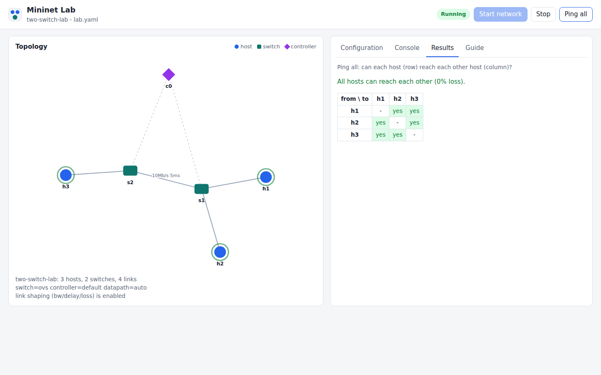
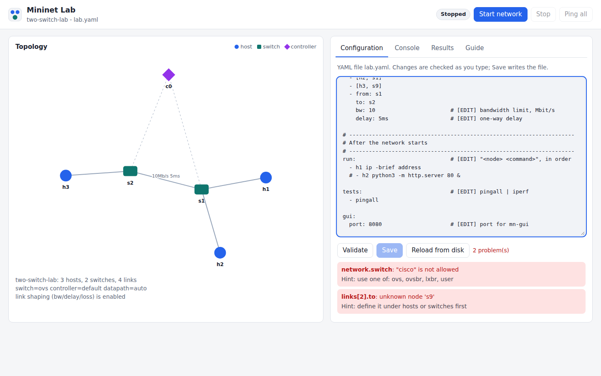
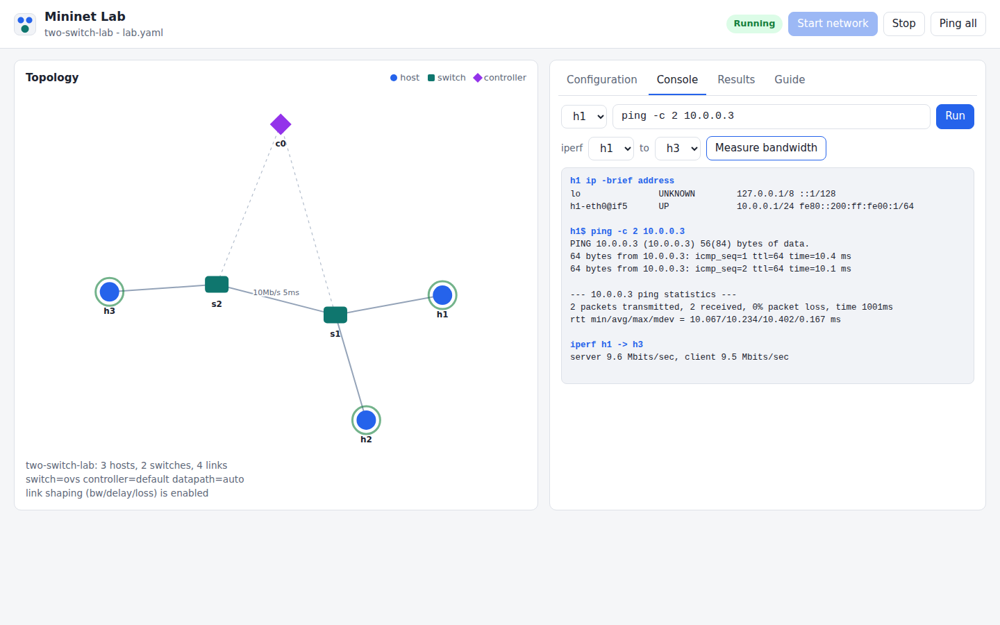

<h1 align="center">Mininet</h1>

<p align="center">
  <strong>Emulate a whole network on your laptop — from the command line or your browser —<br>
  on Linux, Windows, macOS, virtual machines and Docker.</strong>
</p>

<p align="center">
  <a href="https://github.com/Mangesh-Bhattacharya/mininet/actions/workflows/tests.yml"></a>
  <a href="https://github.com/Mangesh-Bhattacharya/mininet/actions/workflows/install-matrix.yml"></a>
  <a href="https://github.com/Mangesh-Bhattacharya/mininet/actions/workflows/docker.yml"></a>
  <a href="https://github.com/Mangesh-Bhattacharya/mininet/actions/workflows/launchers.yml"></a>
  <a href="https://github.com/Mangesh-Bhattacharya/mininet/actions/workflows/security.yml"></a>
  <a href="LICENSE"></a>
</p>

<p align="center">
  
</p>

Mininet creates a realistic virtual network — hosts, switches, links and
an SDN controller — using real Linux networking, in seconds, on one
machine. It is the standard tool for learning and prototyping
Software-Defined Networking and OpenFlow.

This is a **maintained, cross-platform edition** of
[mininet/mininet](https://github.com/mininet/mininet) (2.3.1b4). It keeps
Mininet's Python API and `mn` command fully compatible, and adds what a
student or first-time user needs today:

- **Runs everywhere** — native Ubuntu/Debian, Windows (WSL 2 or Docker),
  macOS (Intel and Apple Silicon), any VM, or a single `docker run`.
- **A browser GUI** — draw, edit, run and test a network from any browser.
- **Lab files in the language you know** — YAML, JSON, Python, C, C++, C#,
  Java, Ruby or COBOL, with checks that explain every mistake.
- **Secure and patched weekly** — signed, scanned container images and
  automated dependency updates.

---

## Contents

- [Quick start](#quick-start)
- [Command line and browser GUI](#command-line-and-browser-gui)
- [Lab configuration files](#lab-configuration-files)
- [What's included](#whats-included)
- [Supported platforms](#supported-platforms)
- [Security and updates](#security-and-updates)
- [Documentation](#documentation)
- [Contributing, credits and license](#contributing-credits-and-license)

---

## Quick start

### Any computer with Docker — nothing else to install

Works on Windows, macOS and Linux (amd64 and arm64). Install
[Docker Desktop](https://docs.docker.com/get-docker/) (or OrbStack/Colima
on macOS, Docker Engine on Linux), then:

```bash
docker run --rm -it --privileged ghcr.io/mangesh-bhattacharya/mininet
```

```text
root@mininet:/workspace# mn --test pingall
*** Results: 0% dropped (2/2 received)
```

For the **browser GUI**, publish its port (to your own machine only) and
open the `http://localhost:8080/#token=...` link it prints:

```bash
docker run --rm -it --privileged -p 127.0.0.1:8080:8080 -v "$PWD:/workspace" \
  ghcr.io/mangesh-bhattacharya/mininet mn-gui --config /workspace/lab.yaml
```

(Windows PowerShell: use `${PWD}` and put the command on one line.)
`lab.yaml` is created in your current folder the first time. More in
[docs/install/docker.md](docs/install/docker.md).

### Ubuntu or Debian — native install

Ubuntu 22.04/24.04 and Debian 12/13:

```bash
git clone https://github.com/Mangesh-Bhattacharya/mininet.git
cd mininet
util/install.sh -nv            # installs Mininet and Open vSwitch
sudo mn --test pingall
```

Prefer a package? `dpkg-buildpackage -b` builds a `.deb`
([docs/install/linux.md](docs/install/linux.md#install-as-a-debian-package-deb)).

### Windows 10/11

| Option | When to choose it | How |
|--------|-------------------|-----|
| **Docker Desktop** | quickest | the `docker run` above, or `.\scripts\mininet-docker.ps1 -Gui` from a clone |
| **WSL 2** | full Linux experience, GUI tools, best speed | install Ubuntu in WSL, then the Linux steps above |
| **Virtual machine** | isolated, classroom images | `vagrant up` (below) |

Details: [docs/install/windows.md](docs/install/windows.md).

### macOS (Intel and Apple Silicon)

Use the `docker run` above, or a Linux VM with Multipass/UTM/Vagrant —
[docs/install/macos.md](docs/install/macos.md).

### Any virtual machine

```bash
git clone https://github.com/Mangesh-Bhattacharya/mininet.git && cd mininet
vagrant up && vagrant ssh      # VirtualBox, VMware, Parallels, Hyper-V, libvirt
sudo mn --test pingall
```

Multipass, cloud instances and building a VM image for a class:
[docs/install/virtual-machines.md](docs/install/virtual-machines.md).

### Is my machine ready?

`sudo mn-doctor` checks everything Mininet needs and tells you what to
fix — or, on Windows and macOS, which of the options above to use.

---

## Command line and browser GUI

### Command line

The classic `mn` command is unchanged, so every tutorial and course that
uses Mininet works as before:

```bash
sudo mn                                           # 2 hosts, 1 switch, interactive CLI
sudo mn --topo tree,depth=2,fanout=3 --test pingall
sudo mn --link tc,bw=10,delay=5ms                 # shaped links
mininet> h1 ping -c3 h2
mininet> iperf h1 h2
```

New to Mininet? Start with [docs/getting-started.md](docs/getting-started.md).

### Browser GUI (`mn-gui`)

```bash
sudo mn-gui --config lab.yaml          # then open the URL it prints
```

| | |
|---|---|
|  |  |
| **Edit with instant checking** — mistakes are listed with hints, and Save stays disabled until the file is valid. | **Run commands on any host** and measure bandwidth with iperf. |

- Live topology drawing (hosts, switches, controller, link speeds and delays)
- Start / stop the network, ping matrix, node console, iperf
- A **Guide** tab listing every setting as *edit freely*, *advanced* or *do not edit*
- Light and dark mode; works from the browser on your Windows or Mac
  when Mininet runs in Docker, WSL or a VM
- Locked down by default: listens on `127.0.0.1` only, random access
  token, DNS-rebinding and CSRF protection, strict Content-Security-Policy,
  no external scripts

Full guide, including VMs over SSH: [docs/gui.md](docs/gui.md).

---

## Lab configuration files

Describe a network once, check it, run it — from the command line or the
GUI:

```bash
mn-config init --lang yaml         # write a commented starter file (or c, java, cobol...)
mn-config validate lab.yaml        # check it — no root needed
sudo mn-config run lab.yaml        # start it, run its commands and tests, open the CLI
```

```yaml
version: 1                  # [FIXED]    don't change
name: two-switch-lab        # [EDIT]     your lab
network:
  controller: default       # [EDIT]     default | remote | none
  datapath: auto            # [ADVANCED] leave on auto
hosts:
  - { name: h1, ip: 10.0.0.1/24 }
  - { name: h2, ip: 10.0.0.2/24 }
switches: [ { name: s1 }, { name: s2 } ]
links:
  - [h1, s1]
  - [h2, s2]
  - { from: s1, to: s2, bw: 10, delay: 5ms }   # 10 Mbit/s, 5 ms
tests: [pingall]
```

| Language | File | Language | File | Language | File |
|----------|------|----------|------|----------|------|
| **YAML** (recommended) | `lab.yaml` | Python | `lab.py` | Java | `Lab.java` |
| JSON | `lab.json` | C | `lab.c` | Ruby | `lab.rb` |
| C# | `lab.cs` | C++ | `lab.cpp` | COBOL | `lab.cob` |

Every language produces the same configuration and passes the same
checks. Program configs are compiled and run for you — as your own user,
never as root. Mistakes come back all at once, with a hint:

```text
$ mn-config validate lab.yaml
Configuration problems:
  - netwrok: unknown setting
    hint: did you mean "network"?
  - links[2].to: unknown node 's9'
    hint: define it under hosts or switches first
```

`run` exits non-zero when a test fails, so `sudo mn-config run lab.yaml
--no-cli` works in scripts and autograders. What to edit and what not to,
every setting, and each language: [docs/configuration.md](docs/configuration.md).

---

## What's included

| Tool | What it does |
|------|--------------|
| `mn` | Mininet's launcher and CLI (unchanged) |
| Python API | `from mininet.net import Mininet` — build topologies and experiments in code ([examples/](examples/)) |
| `mn-config` | Lab configuration files in nine languages |
| `mn-gui` | Browser GUI for lab configurations |
| `mn-doctor` | Checks the machine and suggests a working command (`--json` for scripts) |
| MiniEdit | Mininet's original drag-and-drop editor (`examples/miniedit.py`, needs a desktop) |
| Docker image | `ghcr.io/mangesh-bhattacharya/mininet` — `latest` (Python, C, C++, Ruby configs) and `full` (+ Java, C#, COBOL) |
| Launchers | `scripts/mininet-docker.sh` / `.ps1` / `.cmd` — one command on Linux, macOS and Windows |
| VM tooling | `Vagrantfile`, Multipass/cloud-init, tutorial-VM script |
| Debian package | `debian/` — build a `.deb` with `dpkg-buildpackage` |

---

## Supported platforms

Everything below is tested automatically on every change and every week:

| Platform | Tested |
|----------|--------|
| Ubuntu 22.04, 24.04 (native) | install, `pingall` with OVS kernel and userspace datapaths, Linux bridge, shaped links, Mininet's full core and example test suites |
| Ubuntu 22.04/24.04, Debian 12/13 (fresh containers) | `install.sh` from scratch, then real networks |
| Docker image, amd64 and arm64 | networks, lab configs, the GUI, vulnerability scan |
| Browser GUI | driven in Chromium against a real network, light and dark mode; fails on any browser console error |
| Lab configs | all nine languages build and run a real network |
| Debian package | built, installed and used to run a network |
| macOS, Windows | Docker launchers (bash 3.2, PowerShell 5.1/7, `cmd`, Git Bash), `mn-doctor` guidance |
| Python 3.9 – 3.14 | unit tests for `mn-doctor`, `mn-config` and `mn-gui` (including its security checks) |

Mininet needs a Linux kernel, so on Windows and macOS it runs inside
Linux: WSL 2, the Linux VM behind Docker, or a virtual machine.

---

## Security and updates

- **Patched weekly, automatically.** Every Monday the images are rebuilt
  with all Ubuntu security updates, and Dependabot proposes updates for
  every GitHub Action, the base image and Python package. Security fixes
  are proposed immediately.
- **Scanned and signed.** Images with a fixable high or critical
  vulnerability are never published. Published images are signed with
  Sigstore cosign and carry an SBOM and build provenance.
- **Continuously analysed.** CodeQL (Python, JavaScript, C, workflows),
  Trivy, pip-audit and dependency review run on every change and weekly.
- **Pinned supply chain.** Actions pinned to commit SHAs, the base image
  to a digest, Python packages to exact versions.

Verify an image before running it:

```bash
cosign verify ghcr.io/mangesh-bhattacharya/mininet:latest \
  --certificate-identity-regexp '^https://github.com/Mangesh-Bhattacharya/mininet/\.github/workflows/docker\.yml@' \
  --certificate-oidc-issuer https://token.actions.githubusercontent.com
```

Mininet needs root (and `--privileged` in Docker) to create network
namespaces, so run it on a lab machine or VM. Report vulnerabilities
privately — see [SECURITY.md](SECURITY.md).

---

## Documentation

| Topic | |
|-------|---|
| Install | [Linux](docs/install/linux.md) · [Windows](docs/install/windows.md) · [macOS](docs/install/macos.md) · [Docker](docs/install/docker.md) · [Virtual machines](docs/install/virtual-machines.md) |
| Use | [Getting started](docs/getting-started.md) · [Lab configuration files](docs/configuration.md) · [Browser GUI](docs/gui.md) · [Troubleshooting](docs/troubleshooting.md) |
| Security | [Security policy and patching](SECURITY.md) |
| Research | [Mininet-AI: AI controllers, LLM network agents, RL environments and tutoring on Mininet](docs/research/mininet-ai.md) |
| Upstream | [mininet.org](http://mininet.org) · [Walkthrough](http://mininet.org/walkthrough/) · [Python API introduction](https://github.com/mininet/mininet/wiki/Introduction-to-Mininet) · [FAQ](https://github.com/mininet/mininet/wiki/FAQ) |

---

## Contributing, credits and license

Bug reports and pull requests are welcome — especially installation
problems on a platform not covered above. Please include the output of
`sudo mn-doctor --json`. General fixes are also offered upstream (see
[mininet/mininet#1256](https://github.com/mininet/mininet/pull/1256)).

Mininet is developed by Bob Lantz, Brandon Heller, Nikhil Handigol and the
[Mininet contributors](CONTRIBUTORS). This cross-platform edition — the
installers, Docker image, VM tooling, `mn-doctor`, `mn-config`, `mn-gui`,
documentation and security automation — is maintained by
[Mangesh Bhattacharya](https://github.com/Mangesh-Bhattacharya). Both are
distributed under the [BSD 3-Clause License](LICENSE).
